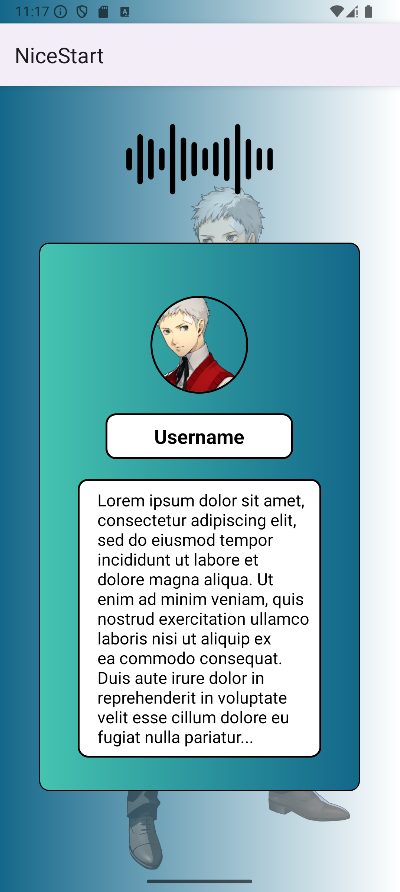

# NiceStart

---

## Index

- ### [Design](#Design)
  - #### [Colors](#Colors)
  - #### [Styles](#Styles)
- ### [Layouts](#Layouts)
  - #### [Login page](#Login)
  - #### [Signup page](#Signup)
  - #### [Main page](#Main)

---

## Design
NiceStart's design is focused on being simple and responsive, using a blue color palette
accented with black and white.

### Colors

> Note: all color names are to reference the names used in the code, they do not necessarily have to be accurate.

- black  `#000000`
- white  `#FFFFFF`
- blue  `#13678A` -> mainly used for the gradient background
- emerald  `#45C4B0` -> to draw user's attention where we want them to look at 
- transparent `#00FFFF00` -> to make the hollow effect, usually accompanied by a border

### Styles

Speaking of which, for the buttons there are two defined styles, ButtonFlat and ButtonOutlined:
- ButtonFlat
  - TextColor = black 
  - BackgroundColor = emerald
  - Stroke (border) = no
  - CornerRadius = 10dp
- ButtonOutlined
  - TextColor = white 
  - TextStyle = bold
  - BackgroundColor = transparent
  - Stroke (border) = yes, white
  - CornerRadius = 10dp

## Layouts
NiceStart is composed by 3 layouts: a login page, a signup page and a main page where the user will
be sent after completing one of the previous pages.
 
Every page has the app's logotype positioned on the top.

### Login
> Note : see [activity_login.xml](app/src/main/res/layout/activity_login.xml) / [activity_signup.xml (land)](app/src/main/res/layout-land/activity_login.xml)

 
The login page has two inputs, one for the username and another for the password.
Under them there are positioned two buttons, which will allow the user to complete the login process
and switch to the signup page, respectively.
 

### Signup
> Note : see [activity_signup.xml](app/src/main/res/layout/activity_signup.xml) / [activity_signup.xml (land)](app/src/main/res/layout-land/activity_signup.xml)

Our signup page is built quite simple, having only a username, email, password and password
confirmation input, all followed by a SIGNUP button that will complete the process and send the
user to the main page. On the other hand, there is a CANCEL button that will stop the process and
return the user to the login page.  
 
It also has an ActionBar that can do the same as the CANCEL button - returning to the login page -.  

### Main
> Note : see [activity_main.xml](app/src/main/res/layout/activity_main.xml) / [activity_main.xml (land)](app/src/main/res/layout-land/activity_main.xml)

After completing the login/signup process the user will be sent to the main page, who has an ActionBar and
the profile of the user, composed by a profile picture, the username and the bio/description the user 
has.  
Also it is important to remark a slight difference between the portrait and the landscape layout, which
is the layout components used for them in order to keep the elements properly displayed:

#### Portrait hierarchy
- main
  - background image
  - logotype
  - guidelines (vertical and horizontal)
  - userLayout (vertical)
    - pfp
    - username
    - user info
    - 
#### Portrait hierarchy
- main
  - background image
  - logotype
  - guidelines (vertical and horizontal)
  - userLayout (vertical)
    - pfp      
    - linear layout (horizontal)
        - username
        - user info

 

> For this project I have used images of characters from Persona 3 Reload, which 
> are the intellectual property of ATLUS Co., Ltd., a division of SEGA Corporation. I fully acknowledge
> that these images, along with all other content related to Persona 3 Reload —including characters, designs,
> artwork, and any related media—are not my property and remain the exclusive rights of ATLUS.  
>  
> The use of these materials in my project is solely for illustrative purposes, and no ownership or 
> affiliation with ATLUS is implied.  
>  
> All rights reserved by ATLUS Co., Ltd.