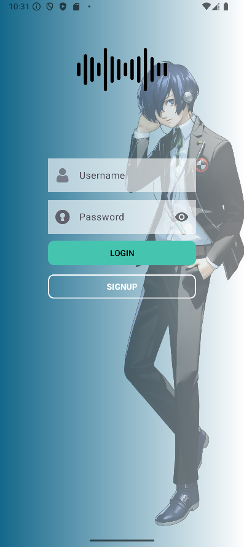
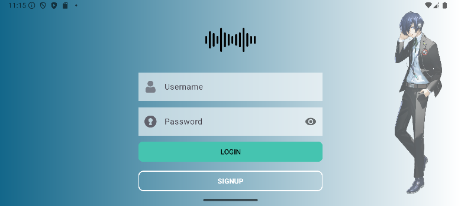
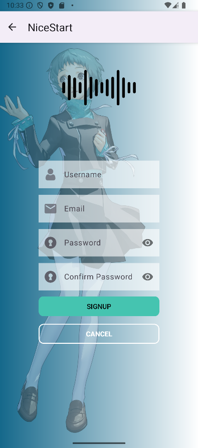
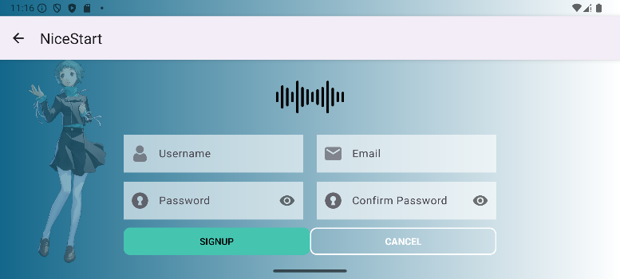
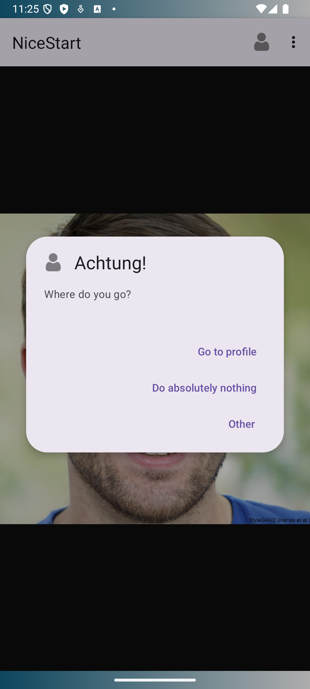
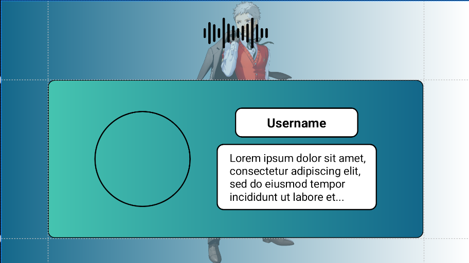
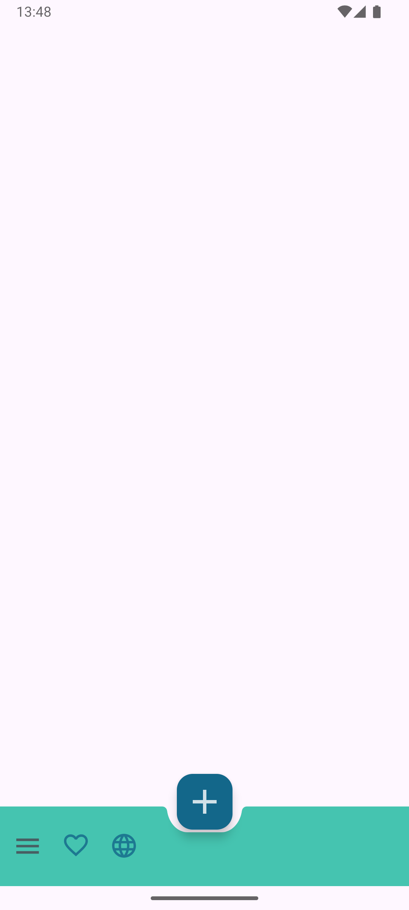

# NiceStart

- ### [Locales](#locales)
- ### [App's Design](#design)
  - #### [Design Colors](#colors)
    - ##### [Light](#light)
    - ##### [Dark](#dark)
  - #### [Component Styles](#styles)
- ### [App's Layouts](#layouts)
  - #### [Splash screen](#splash)
  - #### [Login page](#login)
  - #### [Signup page](#signup)
  - #### [Main page](#main)
  - #### [Profile page](#profile)
  - #### [Bottom Navigation](#bottomnavigation)
  - #### [Bottom App Bar](#bottomappbar)
- ### [Credits](#credits)

## Locales

- [English locales](app/src/main/res/values/strings.xml)
- [Spanish locales](app/src/main/res/values-es/strings.xml)

## Design
NiceStart's design is focused on being simple and responsive, using a blue color palette
accented with black and white.

### Colors

#### Light
> Note: see [colors](app/src/main/res/values/colors.xml)  
> Note: color names are to reference the ones used in the code, they are not necessarily accurate.

- black  `#000000`
- white  `#FFFFFF`
- blue  `#13678A` -> mainly used for the gradient background
- emerald  `#45C4B0` -> to draw user's attention where we want them to look at 
- transparent `#00FFFF00` -> to make the hollow effect, usually accompanied by a border

#### Dark
> Note: see [night\colors](app/src/main/res/values-night/colors.xml)
- black  `#FF555555`
- white  `#FFAAAAAA`
- blue  `#0F4C66` -> mainly used for the gradient background
- emerald  `#16A2A2` -> to draw user's attention where we want them to look at
- transparent `#00FFFF00` -> to make the hollow effect, usually accompanied by a border

### Styles

Speaking of which, for the buttons there are two defined styles, ButtonFlat and ButtonOutlined:
- ButtonFlat
  - TextColor = black 
  - BackgroundColor = emerald
  - Stroke (border) = no
  - CornerRadius = 10dp
- ButtonOutlined
  - TextColor = white 
  - TextStyle = bold
  - BackgroundColor = transparent
  - Stroke (border) = yes, white
  - CornerRadius = 10dp

## Layouts
NiceStart is composed by 3 layouts: a login page, a signup page and a main page where the user will
be sent after completing one of the previous pages.
 
Every page has the app's logotype positioned on the top.

### Splash
> Note : see [activity_splash.xml](app/src/main/res/layout/activity_splash.xml)

Splash screen with tween logo animation and slogan to bring a warm welcome to the user.

### Login
> Note : see [activity_login.xml](app/src/main/res/layout/activity_login.xml) / [activity_login.xml (land)](app/src/main/res/layout-land/activity_login.xml)

 
The login page has two inputs, one for the username and another for the password.
Under them there are positioned two buttons, which will allow the user to complete the login process
and switch to the signup page, respectively.  
  
  
 

### Signup

> Note : see [activity_signup.xml](app/src/main/res/layout/activity_signup.xml) / [activity_signup.xml (land)](app/src/main/res/layout-land/activity_signup.xml)

Our signup page is built quite simple, having only a username, email, password and password
confirmation input, all followed by a SIGNUP button that will complete the process and send the
user to the main page. On the other hand, there is a CANCEL button that will stop the process and
return the user to the login page.  
 
It also has an ActionBar that can do the same as the CANCEL button - returning to the login page -.  
 

 

### Main

> Note : see [activity_main.xml](app/src/main/res/layout/activity_main.xml)

After completing the login/signup process the user will be sent to the main page, which,
with a SwipeRefreshLayout, is able to reload an image in a WebView.  
Also has a menu on the ActionBar able to send the user to the profile page via MaterialAlertDialogBuilder.

 

 

### Profile
> Note : see [activity_profile.xml](app/src/main/res/layout/activity_profile.xml) / [activity_profile.xml (land)](app/src/main/res/layout-land/activity_profile.xml)

After the "Go to profile" option has been selected the user wil be sent to the profile page, which contains
a profile picture, the username and the bio/description the user
has.

 

 

### BottomNavigation

> Note : see [activity_main_bn.xml](app/src/main/res/layout/activity_main_bn.xml)

### BottomAppBar

> Note : see [activity_main_bab.xml](app/src/main/res/layout/activity_main_bab.xml)

## Credits

> #### Images
> 

> 
> For this project I have used images of characters from Persona 3 Reload, which 
> are the intellectual property of ATLUS Co., Ltd., a division of SEGA Corporation. I fully acknowledge
> that these images, along with all other content related to Persona 3 Reload —including characters, designs,
> artwork, and any related media—are not my property and remain the exclusive rights of ATLUS.  
>  
> The use of these materials in my project is solely for illustrative purposes, and no ownership or 
> affiliation with ATLUS is implied.  
>  
> All rights reserved by ATLUS Co., Ltd.
> 
> Also, people shown in the main page are retrieved from https://thispersondoesnotexist.com/  
>  
> #### Icons
> 

>
> 
